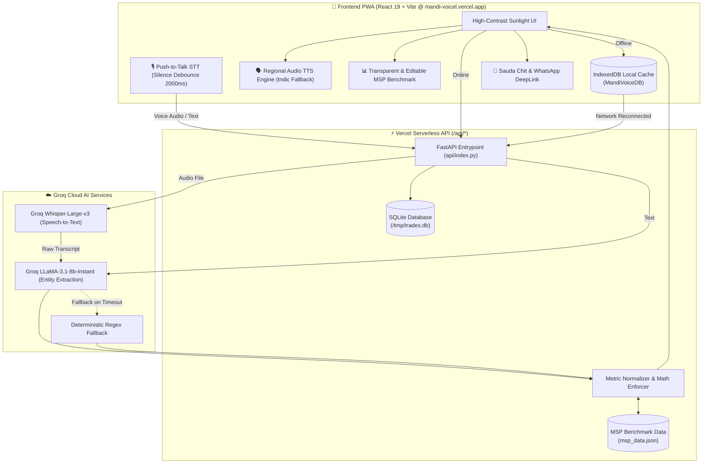

<div align="center">


# MandiVoice (मंडीवॉइस)
### APMC Smart Voice Trading, MSP Compliance & Digital Ledger

[](https://mandi-voicel.vercel.app/)

[](https://fastapi.tiangolo.com)
[](https://www.python.org)
[](https://react.dev)
[](https://vitejs.dev)
[](https://tailwindcss.com)
[](https://groq.com)
[](https://developer.mozilla.org/en-US/docs/Web/API/IndexedDB_API)
[](#-benchmark--evaluation-suite)
[](LICENSE)

*A bilingual, voice-first trade extraction engine and APMC price verification ledger tailored for Indian agricultural mandis.*

**🌐 Experience Live App:** [https://mandi-voicel.vercel.app/](https://mandi-voicel.vercel.app/)

</div>

---

## 📌 Executive Summary

Agricultural mandis (APMCs) across India handle billions of rupees in grain and produce every day through rapid, verbal auctions. However, the ecosystem faces fundamental friction:
- **Language & Dialect Diversity**: Trading takes place in regional vernaculars (Hindi, Telugu, Marathi, Hinglish) with localized jargon.
- **Non-Metric Units**: Traders quote in regional measures—*Bori* (50 kg), *Mann* (40 kg), *Dharhi* (5 kg), *Katta*, *Bastalu*—leading to arithmetic confusion and exploitation.
- **Price Transparency & MSP Gaps**: Farmers often sell below the Government's Minimum Support Price (MSP) without immediate realization.
- **Mandi Deductions Complexity**: Unloading fees (*Hamali*) and APMC market cess (1.5%) distort in-hand payouts.
- **Unstable Yard Connectivity**: Mandi sheds frequently suffer from network blackouts, preventing cloud-only apps from operating reliably.

**MandiVoice** bridges this divide with a high-contrast, offline-resilient mobile PWA and high-speed extraction pipeline. It captures natural voice dialogues, normalizes metric weights, verifies real-time MSP compliance, calculates net farmer in-hand payouts, and dispatches verifiable digital chits over WhatsApp.

---

## 🚀 Key Features

### 1. 🎙️ Multi-Lingual Push-to-Talk STT with Silence Debounce
- **Long-Sentence Continuity**: Uses `continuous = true` and `interimResults = true` with a **2000ms silence debounce timer**, preventing premature cutoffs while farmers speak long, descriptive mandi sentences.
- **Strict Locale Binding**: Automatically binds the speech recognition engine to the active regional language:
  - Hindi / Hinglish: `hi-IN`
  - Telugu: `te-IN`
  - Marathi: `mr-IN`
  - English: `en-IN`
- **Hybrid Processing**: Sends audio directly to Groq Cloud Whisper Large v3 / LLaMA-3.1-8b-instant with a zero-latency local fallback regex engine.

### 2. ⚖️ Strict Metric Normalization & Math Fidelity
- Standardizes all traditional non-metric Indian weight measures into SI kilograms:
  $$\text{Standard Quantity (kg)} = \text{Raw Quantity} \times \text{Multiplier}$$
  $$\text{Bori} = 50\text{ kg} \quad\vert\quad \text{Quintal} = 100\text{ kg} \quad\vert\quad \text{Mann} = 40\text{ kg} \quad\vert\quad \text{Dharhi} = 5\text{ kg} \quad\vert\quad \text{Kg} = 1\text{ kg}$$
- Enforces strict arithmetic verification for both `per_quintal` and `per_kg` rates.

### 3. 📊 Transparent & Editable APMC MSP Benchmark Intelligence
- **Visual Benchmark Pill**: Shows exact comparison right alongside the rate:
  - *e.g., "Govt MSP: ₹2,425/qtl (Agmarknet 2025-26)"*
  - Detailed formula indicator: `Negotiated: ₹2,300/qtl vs MSP: ₹2,425/qtl → 5.15% Deficit`
- **Dynamic In-Card MSP Editing**: Commission agents and APMC secretaries can customize the benchmark rate directly on the card to match daily APMC market yard circulars.
- **Instant Recalculation**: Tapping "Apply & Recalculate" dynamically updates the alert badge between 🔴 **Below MSP Alert** and 🟢 **Fair Market Rate**.
- Custom benchmark values persist through to the physical receipt and WhatsApp chit.

### 4. 🗣️ Robust Regional Voice Feedback (TTS) with Indic Fallback
- Automatic speech synthesis in the selected language with cadence set to 0.95 for clear regional comprehension:
  - **Hindi**: *"{seller} जी, {qty} {unit} {commodity}, कुल ₹{total} रुपये. कन्फर्म करें?"*
  - **Telugu**: *"{seller} గారు, {qty} {unit} {commodity}, మొత్తం ₹{total} రూపాయలు. ఖరారు చేయాలా?"*
  - **Marathi**: *"{seller} जी, {qty} {unit} {commodity}, एकूण ₹{total} रुपये. नक्की करायचे का?"*
  - **English**: *"{seller}, {qty} {unit} of {commodity}, total ₹{total}. Confirm this trade?"*
- **Phonetic Fallback Pipeline**: If a client device lacks pre-installed Telugu or Marathi native OS voice packages, the engine gracefully routes Devanagari text through installed Indic voices (`hi-IN` / `en-IN`) ensuring 100% audio reliability.

### 5. 💰 APMC Mandi Deductions Engine
- Automatically deducts standard regulated market fees:
  - **Hamali (Labour/Unloading)**: ₹10 per bag/bori (or ₹20 per quintal)
  - **APMC Mandi Cess**: 1.5% of Gross Deal Value
  - **Net Farmer Payout**: $\text{Gross} - \text{Hamali} - \text{Mandi Cess}$
- Itemized breakdown toggle provides full transparency for both farmers and commission agents.

### 6. 📶 Offline-Tolerant Cache & Auto-Sync (IndexedDB)
- Mandi transactions can be confirmed and logged even when completely disconnected.
- Backed by native browser `IndexedDB` (`MandiVoiceDB`, store `offline_trades`).
- Status indicator: **🟢 Online (Mandi Cloud)** vs. **🟠 Mandi Offline Mode (Local Cache)**.
- Silent, resilient fallbacks prevent intrusive red error toasts during poor yard connectivity; trades auto-sync when network is restored.

### 7. 📲 Digital Sauda Chit (WhatsApp & Thermal Print)
- Deep-links directly to WhatsApp (`https://wa.me/?text=...`) with structured itemized slips.
- Formatted POS thermal print receipt modal for physical 58mm/80mm ticket printers.

---

## 🏗️ System Architecture



---

## 📁 Repository Structure

```text
MandiVoice/
├── api/
│   ├── index.py               # Vercel Serverless Function entrypoint (FastAPI ASGI handler)
│   ├── requirements.txt       # Cloud serverless Python dependencies
│   └── backend/               # Bundled serverless backend package
│       ├── main.py
│       ├── extractor.py
│       └── msp_data.json
├── backend/
│   ├── extractor.py           # Multi-lingual speech & entity extraction (Groq + Fallback)
│   ├── main.py                # FastAPI routes, SQLAlchemy models, and SQLite setup
│   ├── msp_data.json          # Government benchmark MSP reference rates
│   ├── requirements.txt       # Backend dependencies
│   └── vercel.json            # Standalone backend deployment config
├── eval/
│   ├── benchmark_eval.py      # Automated 12-case benchmark evaluation suite
│   └── benchmark_results.json # Exported benchmark evaluation report
├── frontend/
│   ├── package.json           # Frontend launcher scripts
│   └── mandivoice---apmc-smart-voice-trading-&-ledger/
│       ├── public/
│       │   └── logo.png       # Official MandiVoice brand logo & favicon
│       ├── src/
│       │   ├── components/
│       │   │   ├── MicButton.jsx    # Push-to-talk mic with 2000ms silence debounce
│       │   │   ├── TradeCard.jsx    # Trade card with editable MSP benchmark & net payout
│       │   │   └── TradeLedger.jsx  # Live ledger table, Chit modal & WhatsApp share
│       │   ├── utils/
│       │   │   ├── apiConfig.js     # Unified origin API resolution
│       │   │   ├── apmcFees.js      # Hamali & cess calculation + WhatsApp chit formatter
│       │   │   ├── i18n.js          # Multi-lingual localization strings (5 languages)
│       │   │   ├── offlineDb.js     # Native IndexedDB wrapper & auto-sync logic
│       │   │   └── tts.js           # Regional voice synthesis with Indic phonetic fallback
│       │   ├── App.jsx              # Main dashboard with language selector & offline banner
│       │   └── main.tsx             # React entry point
│       ├── index.html         # PWA HTML shell with favicon configuration
│       └── vite.config.ts     # Vite build settings
├── package.json               # Root monorepo build coordinator
├── vercel.json                # Vercel unified monorepo deployment config (v2 builds & routes)
├── .gitignore                 # Production ignore rules
└── README.md                  # System documentation
```

---

## 📊 Benchmark & Evaluation Suite

MandiVoice includes a standalone automated evaluation script ([eval/benchmark_eval.py](eval/benchmark_eval.py)) testing 12 diverse Hindi, Telugu, Marathi, and Hinglish mandi trade dialogues spanning multiple commodities and non-metric unit conversions.

To run the evaluation:
```bash
python eval/benchmark_eval.py
```

### Evaluation Output:
```text
======================================================================================
  MANDIVOICE BENCHMARK EVALUATION SUITE  (Module 5)
  Testing: Speech Entity Extraction | Metric Fidelity | APMC MSP Compliance
======================================================================================
#   | Commodity | Kg (Std)   | Total (INR)  | Below MSP  | Latency  | Status
--------------------------------------------------------------------------------------
1   | wheat     | 1000.0     | INR 23000    | True       |   30.6ms | PASS
2   | chana     | 5000.0     | INR 290000   | False      |    5.6ms | PASS
3   | mustard   | 400.0      | INR 24800    | False      |    6.5ms | PASS
4   | paddy     | 5000.0     | INR 105000   | True       |    4.8ms | PASS
5   | soybean   | 1500.0     | INR 67500    | True       |    4.5ms | PASS
6   | cotton    | 1600.0     | INR 120000   | False      |    6.3ms | PASS
7   | wheat     | 40.0       | INR 1000     | False      |    4.6ms | PASS
8   | mustard   | 2500.0     | INR 140000   | True       |    4.7ms | PASS
9   | paddy     | 20000.0    | INR 480000   | False      |    4.6ms | PASS
10  | chana     | 1500.0     | INR 81000    | True       |    3.9ms | PASS
11  | soybean   | 1000.0     | INR 51000    | False      |    3.5ms | PASS
12  | cotton    | 1000.0     | INR 68000    | True       |    3.6ms | PASS
--------------------------------------------------------------------------------------

======================================================================================
  AGGREGATE BENCHMARK PERFORMANCE REPORT
======================================================================================
  • Total Benchmark Test Cases : 12
  • Entity Extraction Accuracy  : 100.0% (12/12)
  • Math & Weight Fidelity     : 100.0% (12/12)
  • MSP Benchmark Alert Accuracy: 100.0% (12/12)
  • Overall Pipeline Pass Rate : 100.0%
  • Average Request Latency    : 6.93 ms
======================================================================================
```

---

## ⚡ Quick Start & Installation

### Option A: Open the Deployed Cloud App
Simply visit **[https://mandi-voicel.vercel.app/](https://mandi-voicel.vercel.app/)** on your desktop or mobile browser.

---

### Option B: Run Locally

#### Prerequisites
- **Python 3.10+** (Python 3.12 recommended)
- **Node.js 18+** & **npm**

#### 1. Clone the Repository
```bash
git clone https://github.com/dnyanu0909/MandiVoice.git
cd MandiVoice
```

#### 2. Backend Setup
```bash
cd backend
python -m venv venv

# Windows
venv\Scripts\activate
# Linux / macOS
source venv/bin/activate

pip install -r requirements.txt
```

*(Optional)* Set your Groq API key for cloud Whisper/LLaMA processing (if omitted, the built-in deterministic fallback parser runs automatically):
```bash
# Windows PowerShell
$env:GROQ_API_KEY="your-groq-api-key"

# Linux / macOS
export GROQ_API_KEY="your-groq-api-key"
```

Start the backend API server:
```bash
uvicorn main:app --reload --host 0.0.0.0 --port 8000
```
API Documentation will be live at: [http://127.0.0.1:8000/docs](http://127.0.0.1:8000/docs)

#### 3. Frontend Setup
Open a new terminal window:
```bash
cd frontend
npm install
npm run dev
```
Open your browser at: **[http://localhost:3000](http://localhost:3000)**

---

## 📡 API Reference

| Method | Endpoint | Description |
| :--- | :--- | :--- |
| `POST` | `/api/transcribe-and-extract` | Accepts audio blob or text transcript; extracts entities, converts metrics, and flags MSP. |
| `POST` | `/api/verify-trade` | Validates an extracted trade object and computes price deviation against MSP. |
| `POST` | `/api/confirm-trade` | Commits verified trade record (with custom `benchmark_msp`) into SQLite database. |
| `POST` | `/api/sync-offline` | Batch synchronizes unsynced trades captured in offline IndexedDB mode. |
| `GET`  | `/api/trades` | Retrieves trade history ordered by newest first. |
| `GET`  | `/api/msp-data` | Returns current Government Minimum Support Price benchmarks. |

---

## 🛡️ License

This project is licensed under the MIT License - see the [LICENSE](LICENSE) file for details.

---

<div align="center">
<b>MandiVoice • APMC Smart Voice Trading & Ledger</b><br>
<i>Empowering Indian Farmers & Mandi Traders with Voice AI & Price Transparency</i>
<br><br>
<b>Live URL:</b> <a href="https://mandi-voicel.vercel.app/">https://mandi-voicel.vercel.app/</a>
</div>
